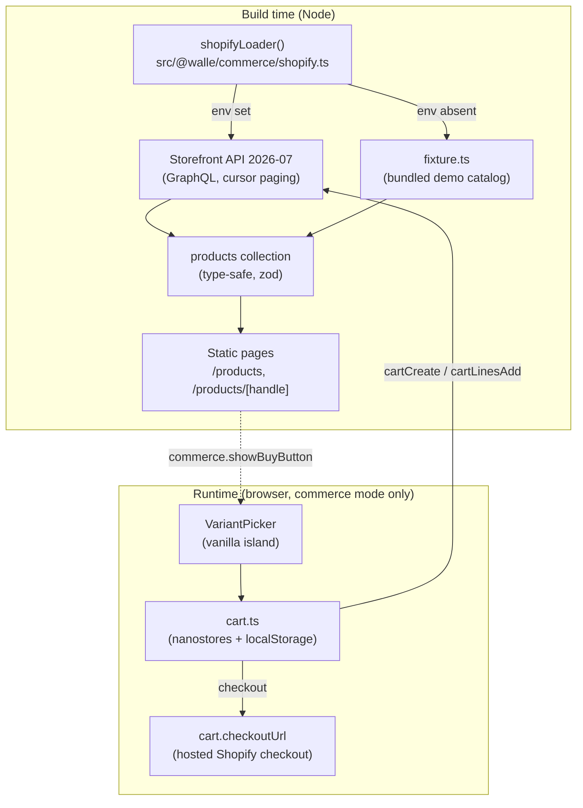

# Commerce (Shopify headless)

Walle ships an optional commerce layer: a **Shopify headless** catalog read at build time, a
**client-side cart**, and the **hosted Shopify checkout**. The site stays fully static (no SSR, no
adapter, no own backend, no payment data). It is transparent to use: a consumer sets two environment
variables to go live, or ships the bundled demo catalog with none.

Design rationale and the full do/don't list live in the investigation report:
`openspec/changes/walle-design-system-maturity/shopify-astro-headless-report.md`.

## Architecture



The catalog is **slow data** (changes hours/days) so it lives at build time. The cart is **per-user
data** so it lives only in the browser. Neither needs SSR.

## Two modes

`commerce.showBuyButton` in `src/configs/app.json` decides the mode:

| Mode        | `showBuyButton` | What renders                                                        |
| ----------- | --------------- | ------------------------------------------------------------------- |
| **Vetrina** | `false`         | Catalog, product pages, gallery, upsell. No cart, no add-to-cart, zero cart JS. |
| **Shop**    | `true`          | All of the above plus the variant add-to-cart, cart drawer, and hosted checkout. |

### Mock mode (shop without a store)

When commerce is enabled (`showBuyButton: true`) **but no Storefront env vars are set**, the cart runs
against an **in-memory mock** (`cart-mock.ts`) built from the fixture: add/update/remove and a demo
checkout page all work, so the full flow is reviewable with zero credentials. The mock cart persists
in `localStorage`, so it survives navigation just like the live cart. As soon as the real env vars are
present, `cart.ts` switches to the live Storefront Cart API — same UI, no code change. The demo site
in this repo runs in **shop + mock** mode; set `showBuyButton: false` for a pure vetrina.

**Cart placement**: `commerce.cartInNavbar: true` puts the trigger in the navbar (via its `actions`
slot); `false` (default) shows a floating badge bottom-right.

**Product card controls**: the listing uses `ProductBuyCard` in shop mode. Add-to-cart, size chips
(sold-out values disabled), quantity, and the "View details" link are each a prop, so a consumer turns
them on or off per project. The detail page's `VariantPicker` takes the same options.

## Setting up Shopify (step by step)

You need a Shopify store on any paid plan (Basic is the practical floor for headless). Everything
below is done once; after that the merchant only manages products in Shopify Admin.

### 1. Create a store and add products

In **Shopify Admin → Products**, add your products. For each product:

- Set a **title**, **description** (this becomes the product page body — write it well, it is synced
  verbatim), and **media** (the first image is the card/hero image).
- Add **options** (e.g. `Size: S / M / L`). Each option combination is a **variant** with its own
  price, `compare-at price` (for discounts), and stock. Walle builds the size chips and the
  add-to-cart from exactly these — no extra config.
- Optionally set a **product type** (used as the catalog filter facet) and **tags**.

### 2. Enable the Headless channel and get the public token

1. **Settings → Apps and sales channels → Shopify App Store**, install **Headless** (Shopify's
   first-party headless channel).
2. Open the Headless channel → **Manage → Storefront API**. Copy the **public access token**
   (labelled "public"). This token is designed to be exposed in the browser; it can read the catalog
   and manage carts, nothing else.
3. **Never** use the Admin API token or a private/secret token in the site.

> Only products **published to the Headless channel** appear in the Storefront API. On each product,
> **Publishing → Headless** must be on. A "missing product" is almost always an unpublished one.

### 3. Configure the two environment variables

```bash
PUBLIC_SHOPIFY_STORE=my-store                    # the subdomain of my-store.myshopify.com
PUBLIC_SHOPIFY_STOREFRONT_TOKEN=<public-token>   # from step 2
```

Set them locally (`.env`) and in your CI/host (GitHub Actions secrets, Netlify/Cloudflare env). The
`PUBLIC_` prefix is required — these are read in the browser by the cart.

With the vars present, `shopifyLoader()` fetches the **live** catalog at build; without them it falls
back to the bundled fixture. No code change either way.

### 4. Turn on selling

In `src/configs/app.json`:

```json
"commerce": { "showBuyButton": true, "cartInNavbar": true, "locale": "en-US" }
```

- `showBuyButton: false` → **vetrina** (catalog only, no cart, zero cart JS).
- `showBuyButton: true` → **shop** (add-to-cart, cart drawer, hosted Shopify checkout).
- `cartInNavbar` → cart trigger in the navbar (`true`) or floating bottom-right (`false`).

Install the cart runtime deps once: `yarn add nanostores @nanostores/persistent`.

### 5. (Optional) complementary recommendations

The "You might also like" block uses Shopify's `RELATED` recommendations, which work out of the box.
For curated "Pair it with" (`COMPLEMENTARY`) results, install the **Search & Discovery** app in
Shopify Admin and configure complementary products there.

### 6. Rebuild when the catalog changes

The catalog is baked at build time, so a product change needs a rebuild:

1. Create a **build hook** on your host (Netlify / Cloudflare Pages / a GitHub Actions
   `workflow_dispatch` or `repository_dispatch`).
2. In **Shopify Admin → Settings → Notifications → Webhooks**, add webhooks for
   `products/create`, `products/update`, `products/delete` pointing at the build hook URL.
3. Now: merchant edits a product → webhook fires → site rebuilds → catalog is current. The loader
   `digest` keeps rebuilds incremental (unchanged products are not re-processed).
4. Treat the build hook URL as a secret (anyone with it can trigger builds).

## Managing the store

Day to day, the merchant works **only in Shopify Admin** — no code:

| To… | Do this in Shopify Admin | Appears after |
| --- | --- | --- |
| Add / remove a product | Products → add or delete (publish to Headless) | next rebuild |
| Change price or start a sale | edit the variant price / set a compare-at price | next rebuild (the `-X%` badge is automatic) |
| Add or change sizes | edit the product's options/variants | next rebuild (chips rebuild from options) |
| Mark something sold out | set the variant's stock to 0 / mark unavailable | next rebuild (chip disabled, "Sold out") |
| Edit the product page copy | edit the product description | next rebuild |
| Reorder the gallery | reorder product media | next rebuild |

The store's look (buttons, cards, cart) is controlled by walle tokens and the `commerce.*` flags, not
by Shopify. The **cards build themselves from each product's options** — a single-variant product
shows just price + add-to-cart; a product with sizes shows the size chips.

## Files

| File                                       | Role                                                                    |
| ------------------------------------------ | ----------------------------------------------------------------------- |
| `src/@walle/commerce/shopify.ts`           | GraphQL client, product query, Content Layer loader, presentation helpers |
| `src/@walle/commerce/fixture.ts`           | Offline demo catalog (same shape as the live response)                  |
| `src/@walle/commerce/VariantPicker.astro`  | Vanilla variant selector: option chips (sold-out disabled), live price/availability, optional quantity stepper, add-to-cart. All controls are props (`showBuyButton`, `showQuantity`, `hideOptions`, `compact`) |
| `src/@walle/commerce/ProductBuyCard.astro` | Listing card with configurable buy controls (`showAddToCart`, `showSizes`, `showQuantity`, `showDetailsLink`), composing the visual with a compact VariantPicker |
| `src/@walle/commerce/CartBadge.astro`      | Cart trigger, floating or in the navbar (`commerce.cartInNavbar`) |
| `src/@walle/commerce/cart.ts`              | Client cart: nanostores + Storefront Cart API; `addToCart`/`updateLine`/`removeLine`/`goToCheckout` |
| `src/@walle/commerce/cart-mock.ts`         | In-memory cart from the fixture; used when commerce is on but no store is connected |
| `src/@walle/commerce/CartMount.astro`      | Cart badge + drawer (`<dialog>`), mounted only in shop mode             |
| `src/content.config.ts`                    | `products` collection + zod schema                                      |
| `src/pages/products/index.astro`           | Listing: `ProductCard` grid + `CollectionFilters` (facet by type)       |
| `src/pages/products/[handle].astro`        | Detail: gallery (zoomable `Carousel`), `descriptionHtml` body, upsell, JSON-LD |

The detail **body** is Shopify's `descriptionHtml`, rendered with `set:html` — the merchant edits it
in Shopify Admin and it syncs on the next build. **Upsell** ("You might also like") comes from the
Storefront `productRecommendations(intent: RELATED)` query, resolved to static links at build.

## Dependencies

The cart layer (shop mode) needs two packages the consumer installs when enabling commerce:

```bash
yarn add nanostores @nanostores/persistent
```

A vetrina needs nothing extra.

## Why a content collection, not generated markdown

The report (§8) treats writing intermediate markdown files as an anti-pattern: the Content Layer
loader is the idiomatic path, and generated files create drift and manual maintenance. Walle follows
the loader approach — the catalog is always a rebuild away from Shopify, never a hand-synced copy.

## Security

- Only the **public** Storefront token reaches the bundle. No Admin API, ever.
- The cart id (`gid://...?key=<secret>`) is persisted in localStorage but never put in shareable URLs.
- `checkoutUrl` is fetched fresh at checkout time, never cached.
- No payment data touches the site; checkout is entirely hosted by Shopify (PCI on Shopify).
